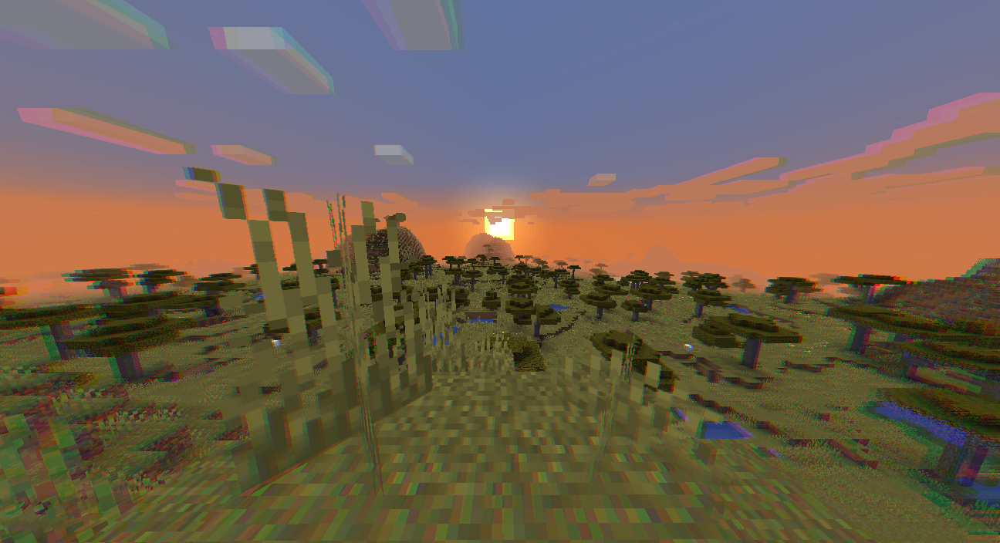
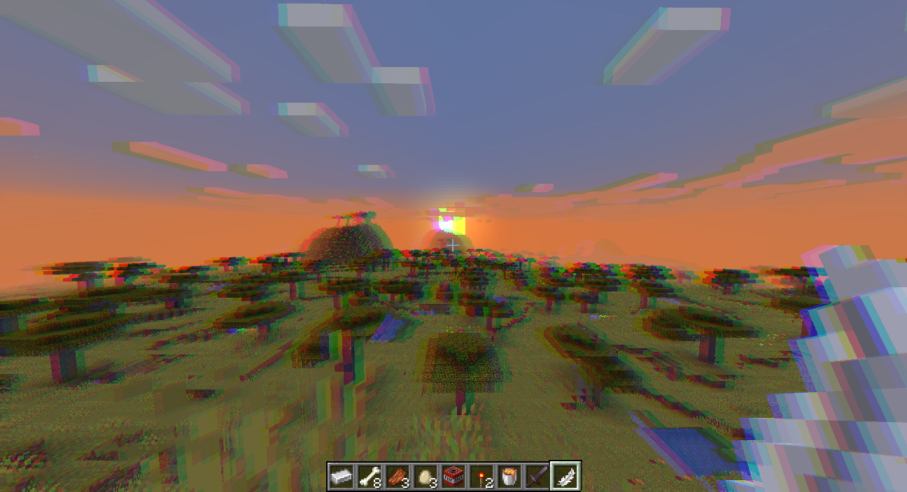
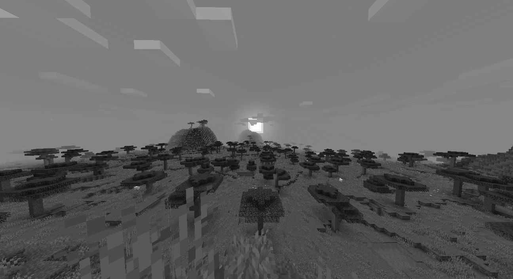
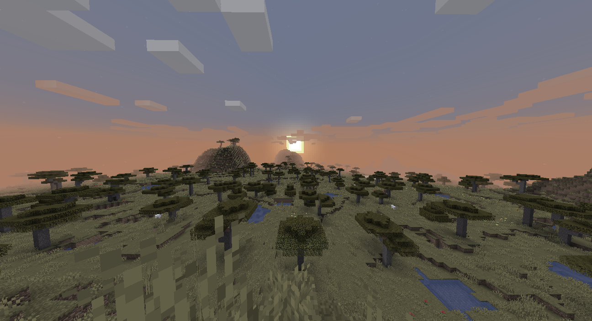
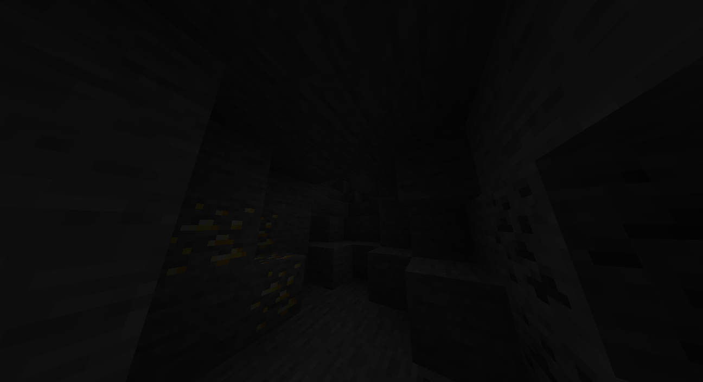
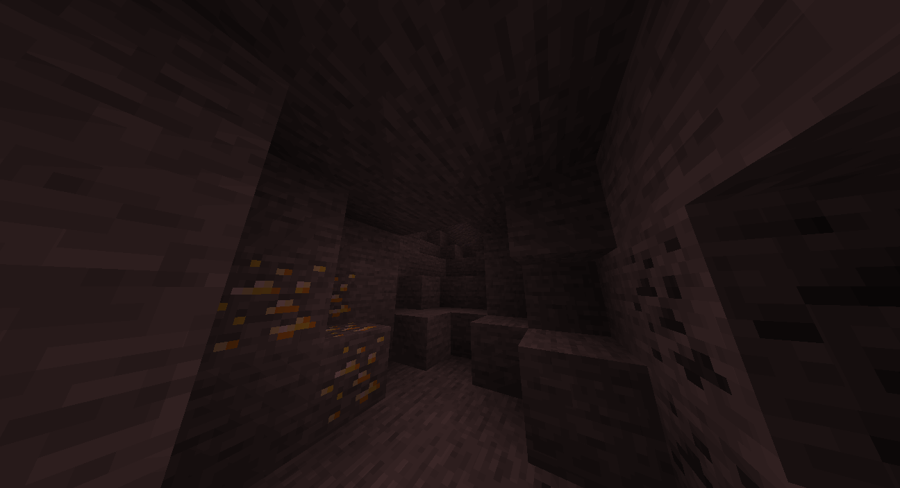
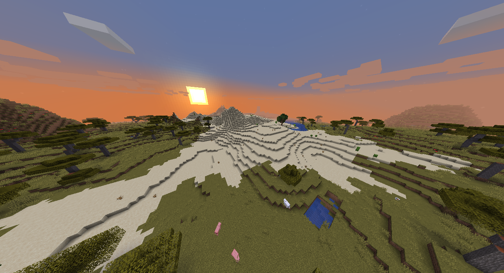
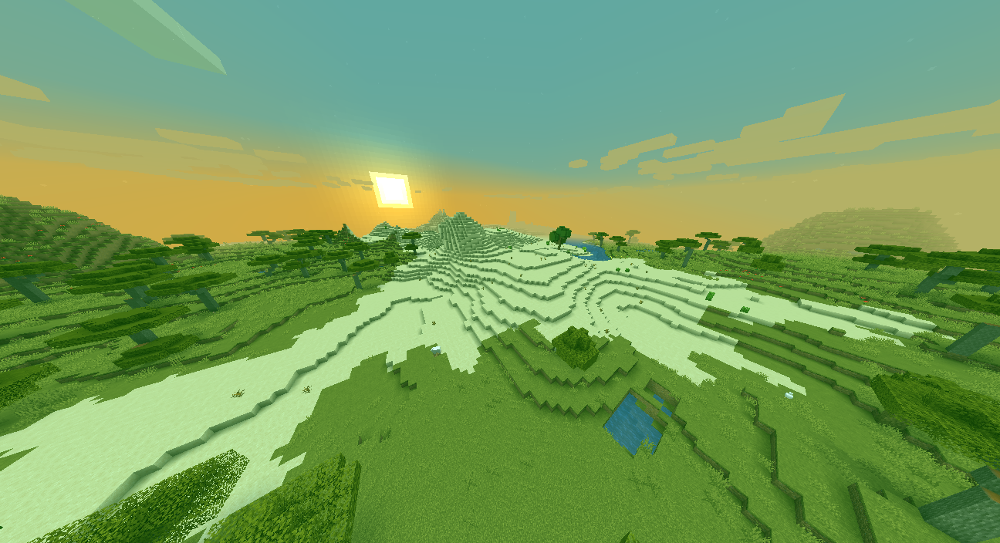
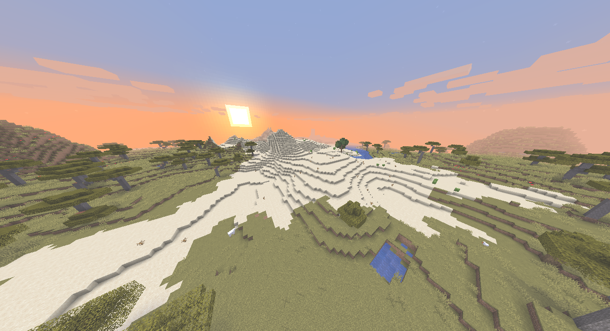

# Effects API
Мод для Forge 1.16.5, который добавляет небольшие шейдеры в игру, которые настраиваются командой и имеют API для других модов.

## API
Есть два способа настройки моды.
1. Командой. <br>Мод добавляет новую команду `/rendereffects [type] [args...]`.
2. Через API мода. 
<br>Первое, что вам надо сделать, это получить инстанс мода, затем, получить экземпляр настроек. 
А потом устанавливать или читать настройки. Ниже приведён пример включения хроматической аберрации.
```java
EffectsAPI.getInstance() // Получаем инстанс мода
        .getSettingsManager() // Получаем менеджер настроек
        .setAberrationMultiplier(0.1F); // Устанавливаем множитель аберрации
```
Подробнее о шейдерах и обращениях к ним описано ниже...

## Какие шейдеры добавляются?
1. Угловая хроматическая аберрация. Это эффект из реального мира, описанный [на русскоязычной Wiki](https://ru.wikipedia.org/wiki/%D0%A5%D1%80%D0%BE%D0%BC%D0%B0%D1%82%D0%B8%D1%87%D0%B5%D1%81%D0%BA%D0%B0%D1%8F_%D0%B0%D0%B1%D0%B5%D1%80%D1%80%D0%B0%D1%86%D0%B8%D1%8F)
или на [англоязычной Wiki](https://en.wikipedia.org/wiki/Chromatic_aberration).

Команда для задания: `/rendereffects chromatic_aberration [multiplier]`
Значение множителя лучше делать в районе `-1F - 1F`
2. Линейная хроматическая аберрация. Делает то же самое, что и угловая хроматическая аберрация, но появляется не только в углах экрана, но и в его центре.

Команда для задания: `/rendereffects linear_chromatic_aberration [multiplier]`
Значение множителя лучше делать в районе `-0.5F - 0.5F`
3. Чёрно-белый фильтр. Множитель задаёт то, насколько картинка будет чёрно-белой (1 - Полностью ЧБ, 0 - Полноцветовая).


Команда для задания: `/rendereffects black_and_white [multiplier]`
Значение множителя задаётся в районе `0F - 1F`
4. Множитель цветовых каналов.<br>Выходная картинка из игры - это набор пикселей, содержащих в себе три цвета (RGB). Конкретно эта настройка, умножает определённый канал на определённый множитель.
Пример: Первая картинка - исходное, вторая - каналы GB умножаются на 2, канал R умножается на 3.


Команда для настройки: `/rendereffects color_multiplier [r_mul] [g_mul] [b_mul]`
Параметры задаются в районе `0F - 4F`
5. Добавщик цветовых каналов. Делает то же самое, что и множитель, но вместо умножения используется добавление.
Пример: Первая картинка - исходное, вторая - добавлено число в канал G, третья - добавлено число ко всем каналам.



Команда для настройки: `/rendereffects color_add [r_add] [g_add] [b_add]`
Параметры задаются в районе `-1F - 1F`

## TODO
1. Добавить эффекты:
  - Гауссовское размытие
  - Гауссов шум
  - Статический шум
2. Добавить возможность изменение порядка применения шейдеров.

## Сборка
1. Скопируйте этот репозиторий.
2. Перейдите в него.
3. Пропишите `./gradlew build` на Linux или `gradlew build` на Windows.
4. Вы найдёте мод в директории `build/libs/effectsapi-{version}.jar`